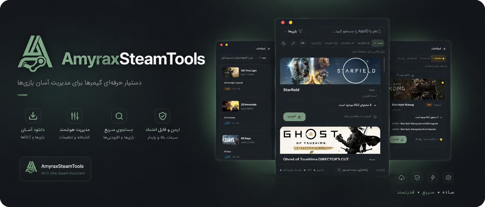

<!--
  IMPORTANT BEFORE PUBLISHING:
  Replace YOUR-USERNAME below with your real GitHub username.
  Keep the repository name AmyraxSteamTools, or replace it too.
  Latest-release URL used by the download button:
  https://github.com/YOUR-USERNAME/AmyraxSteamTools/releases/latest
-->

<div align="center">


<br />

[](https://github.com/YOUR-USERNAME/AmyraxSteamTools/releases/latest)


<br />



<br /><br />

<a href="https://github.com/YOUR-USERNAME/AmyraxSteamTools/releases/latest">
  
</a>

**دکمه بالا همیشه صفحه آخرین نسخه رسمی را باز می‌کند.**

</div>

---

<div dir="rtl">

## درباره AmyraxSteamTools

**AmyraxSteamTools** یک دستیار دسکتاپی سریع و مدرن برای مدیریت ساده‌تر بازی‌ها و محتوای مرتبط با Steam است. رابط برنامه برای استفاده روزمره طراحی شده و از زبان‌های **فارسی و انگلیسی**، حالت روشن و تاریک، جست‌وجوی سریع و مدیریت منظم محتوا پشتیبانی می‌کند.

> هدف پروژه ارائه تجربه‌ای تمیز، قابل‌فهم و یکپارچه برای مدیریت ابزارها و محتوای Steam در ویندوز است.

## قابلیت‌ها

| قابلیت | توضیح |
|---|---|
| 🎮 **مدیریت بازی‌ها** | مشاهده و مدیریت منظم بازی‌ها از یک محیط یکپارچه |
| 🧩 **مدیریت DLC** | مشاهده محتوای DLC موجود و مدیریت ساده‌تر آن‌ها |
| 🔎 **جست‌وجوی سریع** | پیدا کردن بازی‌ها با نام یا AppID |
| ⭐ **علاقه‌مندی‌ها** | ذخیره بازی‌های پراستفاده برای دسترسی سریع‌تر |
| 🌐 **رابط دوزبانه** | پشتیبانی از فارسی راست‌چین و English چپ‌چین |
| 🎨 **ظاهر شخصی‌سازی‌شده** | حالت روشن و تاریک با تنظیمات قابل تغییر |
| 🔐 **فعال‌سازی آفلاین** | فعال‌سازی بدون نیاز به ارتباط با سرور |
| 📦 **نصب استاندارد ویندوز** | فایل Setup رسمی با نام و آیکون AmyraxSteamTools |

## پیش‌نیازهای اجرا

- Windows 10 یا Windows 11
- معماری 64 بیتی (`x64`)
- دسترسی معمولی برای نصب در حساب کاربری
- نصب بودن Steam برای قابلیت‌های مرتبط با کتابخانه Steam

## نصب برنامه

1. از دکمه **Latest Official Release** در بالای صفحه وارد آخرین انتشار رسمی شوید.
2. فایل `AmyraxSteamTools-v1.0.0-Setup.exe` یا جدیدترین Setup موجود را دانلود کنید.
3. برنامه را اجرا و مراحل نصب را تکمیل کنید.
4. AmyraxSteamTools را از Start Menu یا میان‌بر دسکتاپ باز کنید.

> چون برنامه فعلاً امضای دیجیتال تجاری ندارد، ممکن است Windows SmartScreen نمایش داده شود. در این حالت ابتدا **More info** و سپس **Run anyway** را انتخاب کنید؛ فقط فایل منتشرشده در بخش رسمی Releases همین مخزن را دانلود کنید.

## روش استفاده

1. در اولین اجرا، کد فعال‌سازی زیر را وارد کنید:

```text
AmyraxVPN
```

2. زبان فارسی یا انگلیسی و تم دلخواه را از تنظیمات انتخاب کنید.
3. نام بازی یا `AppID` را در بخش جست‌وجو وارد کنید.
4. بازی موردنظر را انتخاب کنید و محتوای موجود را بررسی کنید.
5. برای دسترسی سریع‌تر، بازی‌های پراستفاده را به علاقه‌مندی‌ها اضافه کنید.
6. مسیر Steam و پوشه نصب را پیش از اجرای عملیات بررسی کنید.

## دریافت به‌روزرسانی‌ها

به‌روزرسانی خودکار داخل برنامه غیرفعال است. برای دریافت نسخه‌های جدید، همیشه از بخش رسمی **GitHub Releases** استفاده کنید:

<div align="center">
<a href="https://github.com/YOUR-USERNAME/AmyraxSteamTools/releases/latest">
  
</a>
</div>

## امنیت و استفاده مسئولانه

- برنامه را فقط از صفحه رسمی Releases دانلود کنید.
- پیش از جایگزینی نسخه، برنامه را کامل ببندید.
- از برنامه فقط برای بازی‌ها و محتوایی استفاده کنید که مجاز به استفاده از آن هستید.
- مسئولیت رعایت قوانین Steam، مجوز بازی‌ها و قوانین محل زندگی بر عهده کاربر است.

## پشتیبانی و ارتباط

<div align="center">
<a href="https://t.me/AmyraxVPN">
  
</a>
</div>

## سازنده

- **Name:** AmyraxSteamTools
- **Developer:** Amyrax
- **Version:** 1.0.0
- **Telegram:** [@AmyraxVPN](https://t.me/AmyraxVPN)

---

<div align="center">

ساخته‌شده با تمرکز بر سادگی، سرعت و تجربه کاربری بهتر.

**© 2026 Amyrax**

</div>

</div>
